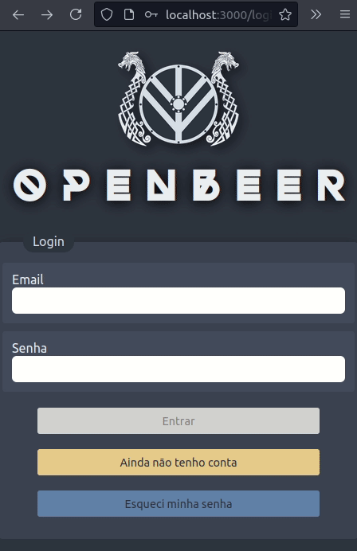
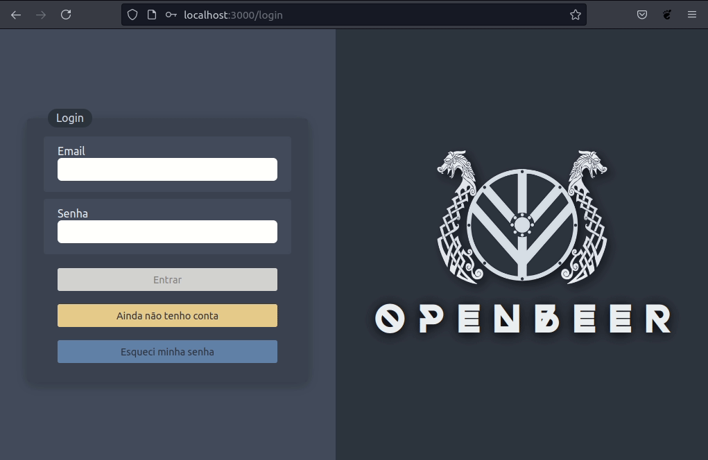
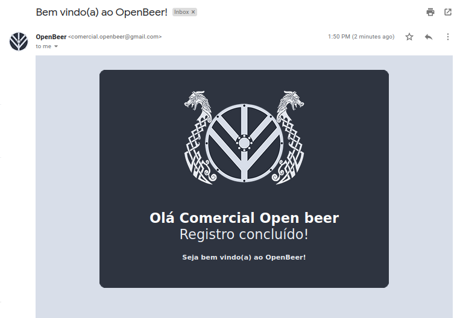

<a name="top"></a>
<p align="center">
  
</p>

<h1 align="center">
OpenBeer v1 
</h1>

<p align="center">
  
  
  
  
  
  
  
</p>

<p align="center">
  Este monorepo é um clone do projeto em grupo de final de módulo, desenvolvido no curso da Trybe, com objetivo de avaliar os conhecimentos em front-end, back-end e integração de sistemas web.
</p>

## Conteúdos

<!--ts-->
   * [Demonstração](#demonstração)
   * [Sobre o projeto](#sobre-o-projeto)
   * [Pré-requisitos](#pré-requisitos)
   * [Como usar](#como-usar)
   * [Tecnologias](#tecnologias)
   * [Features extras](#features-extras)
      * [Email de boas vindas e reset de senha](#email-de-boas-vindas-e-reset-de-senha)
      * [Documentação](#documentação)
   * [Contribuição](#contribuição)
   * [Licença](#licença)
<!--te-->

## Demonstração

<div>
  
  
</div>

##### [🔝 voltar ao início](#top)

## Sobre o projeto

**OpenBeer** é nossa proposta desenvolvida para o desafio de criar uma plataforma de e-commerce de bebidas.

Como cliente, sou capaz de:
- Efetuar cadastro e login na plataforma;
- Realizar um pedido e finalizar o checkout;
- Visualizar meus dados e atualizar meu nome;
- Visualizar meus pedidos e acompanhar o status de entrega;
- Trocar minha senha.

Como vendedor(a) sou capaz de:
- Efetuar cadastro e login na plataforma;
- Visualizar os pedidos efetuados e seus detalhes;
- Marcar um pedido com status de entregue;
- Visualizar meus dados;
- Trocar minha senha.

## Pré-requisitos

Antes de começar, você vai precisar ter instalado em sua máquina as seguintes ferramentas:
[Git](https://git-scm.com), [Node.js](https://nodejs.org/en/) e [Mysql Server](https://dev.mysql.com/downloads/mysql/).
Além disso é bom ter um editor de código como o [VSCode](https://code.visualstudio.com/).

Faça um fork desse repositório e depois um clone para a sua máquina, abra seu terminal e execute os seguintes comandos:

```bash
# Clone o repositório em sua máquina
git clone https://github.com/danieljs-dev/openbeer-v1.git

# Acesse a pasta do projeto no terminal/cmd
cd openbeer-v1

# Abra o código com o Editor de texto (nesse exemplo estou usando o VSCode)
code .
```

##### [🔝 voltar ao início](#top)

## Como usar

***Banco de dados:***

É primordial que antes de rodar a aplicação você crie o banco de dados para o bom funcionamento de todas as funcionalidades. Execute o arquivo `script.sql` que se encontra na raíz da aplicação com seu Gerenciador de Banco de Dados favorito, por exemplo o [Mysql Workbench](https://www.mysql.com/products/workbench/)

Você também pode executar o script sql via linha de comando:
Abra o seu terminal e cole e execute o seguinte comando:

```bash
mysql -u root -p
```

Logo após, copie e cole todo o código do arquivo `script.sql` e execute no terminal, dando tudo certo, você pode dar um **exit** para sair do mysql e voltar ao terminal.

***Variáveis de ambiente:***

O projeto utiliza variáveis de ambiente, você precisará configurar de acordo com as informações do seu Mysql.
Dentro da pasta `back-end/src` existe um arquivo chamado `.env.example`, renomeie esse arquivo tirando do final o ".example", ficando só ".env" e dentro dele contém todas as informaçõess que você irá precisar preencher.

***Iniciando a aplicação***

Estando tudo configurado, finalmente podemos rodar a aplicação. Na raíz do projeto, existem scripts para facilitar a instalação das depêndencias e a inicialização da aplicação. Para iniciar, basta colar e executar no terminal o seguinte comando:

```bash
npm start
```

Aguarde a finalização de todo o processo, e ao concluir, sua aba do navegador abrirá a aplicação, caso não abra automáticamente, abra o seu navegador preferido, ex: (Google Chrome), e digite na barra de pesquisa `localhost:3000` e dê enter.

***Testes (Opcional)***

 

```bash
#Na raíz do projeto, navegue pelo terminal até a pasta back-end
cd back-end

# e rode o comando
npm run test
```

##### [🔝 voltar ao início](#top)

## Tecnologias

As seguintes ferramentas foram usadas na construção do projeto:

***Back-end:***

- [Node.js](https://nodejs.org/en/)
- [Express](https://expressjs.com/)
- [Mysql](https://www.mysql.com/)
- [JWT](https://jwt.io/)
- [BCrypt](https://www.npmjs.com/package/bcrypt)


***Front-end:***

- [React](https://pt-br.reactjs.org/)
- [Axios](https://www.npmjs.com/package/axios/)
- [Yup](https://www.npmjs.com/package/yup/)
- [React Hook Form](https://react-hook-form.com/)

##### [🔝 voltar ao início](#top)

## Features extras

##### Email de boas vindas e reset de senha

<div>
  
  
</div>
</br>

##### Documentação

Caso queira ver os detalhes de todos os endpoints da api, abra no navegador a seguinte url `localhost:3001/doc`.


<div>
  
</div>

##### [🔝 voltar ao início](#top)

## Contribuição

<table>
  <tr>
    <td align="center"><a href="https://github.com/danieljs-dev"><br /><sub><b>danieljs-dev</b></sub></a><br /><a href="https://github.com/danieljs-dev"></a></td>
    <td align="center"><a href="https://github.com/PedimEduardo"><br /><sub><b>Pedro Eduardo</b></sub></a><br /><a href="https://github.com/PedimEduardo"></a></td>
    <td align="center"><a href="https://github.com/phelipe-ohlsen"><br /><sub><b>Phelipe Ohlsen</b></sub></a><br /><a href="https://github.com/phelipe-ohlsen"></a></td>
    <td align="center"><a href="https://github.com/cyranowebdev"><br /><sub><b>Cyrano</b></sub></a><br /><a href="https://github.com/cyranowebdev"></a></td>
  </tr>
</table>

## Licença

Este projeto está sob a licença do MIT. Consulte a [LICENÇA](./LICENSE) para obter mais informações.

##### [🔝 voltar ao início](#top)